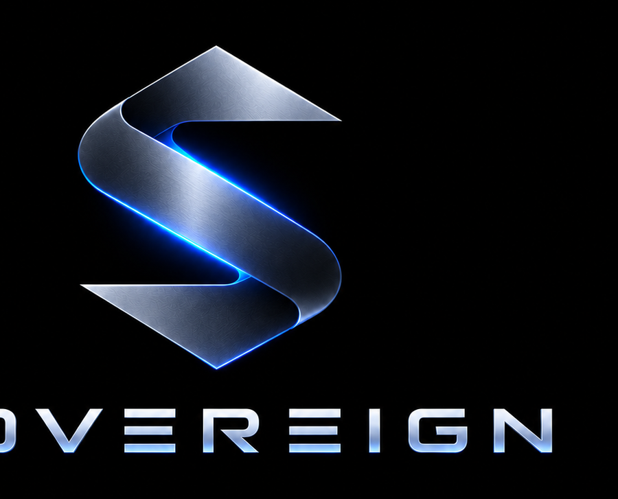

<p align="center"></p>

**Set a goal. A Director agent plans it, builds the team, and runs the work, asking you only for approvals, keys and the few steps only you can do.**


Sovereign opens with a short sequence on a black screen, then asks for one thing: your goal. From there the app walks you through five stages, and the **Director** does the heavy lifting:

1. **Goal**: one sentence, a verified-profit target, starting capital and the most you will lose.
2. **Milestones**: the Director drafts them (or you write your own). Edit anything.
3. **Roadmap**: a full, saved plan of tasks per milestone, each assigned to a role. You approve it once.
4. **Setup**: only the keys and integrations *this* plan uses. A plan with no Etsy step never asks for Etsy. Skip anything and only the tasks that need it wait.
5. **Run**: the Director creates and deploys exactly the agents the plan needs, assigns tasks, and works through the roadmap on its own. Outbound actions (emails, posts, messages) still wait for your approval.

Autonomous does not mean unsupervised. Sovereign is built around **human-gated autonomy**: agents work between checkpoints, and you approve the few decisions that are structural, expensive or irreversible. It does not guarantee profit, and most early ventures will lose small amounts. That is what loss limits are for.

## The interface

- **Left panel** (wide, and expandable with the ⇤ button): **Journey** (the guided stages), **Worlds**, **Agents**, **Integrations**, **Money**, **Outbox**, **Inspect**, **Settings**.
- **Guide bar** across the top shows where you are and the one next thing to do.
- **Station** in the middle with a floating build toolbar (Select, Room, Desk, Hallway, Connector, Agent). Scroll to zoom, drag the floor to pan.
- **Chat** on the right with whichever agent you select. Ask the Director: *"Tell Quill to draft five posts."* Work starts right away and the result lands in the Outbox. Approvals appear at the top of the chat.

## Worlds

A **world** is a whole station of its own: its own Director, rooms, agents, goal and roadmap. Create an e-commerce world and a trading world, then connect them with **portals** so one can hand work to the other. Switch worlds from the header. See [docs/WORLDS.md](docs/WORLDS.md).

## Every agent has a coded job

Each of the 19 roles has a job description, deliverables, a quality bar, a library of tasks, and **saved settings** you can tune (a Content Manager has platforms, posts per week, content pillars, brand voice and a standard call to action). Those settings shape every prompt that agent sees. See [docs/JOBS.md](docs/JOBS.md).

## The station

| Piece | What it is |
|---|---|
| **Room** | A team. Its capabilities are the *ceiling* for everyone inside. |
| **Desk** | Every agent has their own. What an agent can do = desk grants ∩ room ceiling ∩ role ceiling. |
| **Hallway** | An authorized handoff lane between rooms, connectors, the Inbox and the Outbox. |
| **Connector** | A port to the outside world. A hallway reaches it only from a room with the matching capability. |
| **Portal** | A connector that leads to another world. |
| **Inbox / Outbox** | Where work enters and where finished results land as real items. |
| **Director** | The first agent in each world. Only the Director holds `station.edit` and `venture.create`. |

Agents come in 19 roles and 17 character presets you can fine-tune head to toe. Characters are drawn from a small sprite grid and smoothed on the way to the screen.

## Run it

```
git clone <your repo>
cd sovereign
npm start          # Node 18+, no install step, zero dependencies
```

Open http://localhost:8787. It works out of the box on an offline demo model (placeholder output, so you can see the whole flow). In **Settings** choose a real provider: Ollama, OpenRouter, or any OpenAI-compatible endpoint. `npm test` runs the suite.

**Your data lives in `./data` inside the project folder**, including saved keys. Delete the folder and reinstall and you start completely fresh. The folder ignores itself in git. **Settings → Start fresh** erases everything without deleting anything by hand.

### Using Ollama

Sovereign streams answers as they are written, keeps the model loaded between calls, caps context and output length, asks planning calls for JSON, and queues calls so several agents cannot flood one machine (default 2 at once; change it in Settings). Smaller models respond faster, and the first call after a cold start is always the slowest, so use **Warm up model now**. Speed depends on your hardware and model; try **Test speed** on the Setup step.

## Integrations

Read-only sources feed the verified ledger: **Stripe, Shopify, Etsy, WooCommerce, Gumroad, Facebook Ads**. Actions wait for your approval: **Email (Resend), Notion, Google Drive, Google Calendar, Google Sheets, Airtable, Slack, Discord, Telegram, Webhook**. See [docs/INTEGRATIONS.md](docs/INTEGRATIONS.md) for setup and an honest status of what is and is not proven.

## The laws (enforced in code, tested)

1. **The interface never asserts money the harness cannot prove.** Only platform data the harness fetched itself, signed webhooks, and measured model spend are *verified*. Agent claims are stored but never counted.
2. **Budgets and approvals live in code, not prompts.** Daily station and per-agent caps (the station cap spans every world). Structural Director plans and every outbound action need your approval by default. Email has a hard daily send limit.
3. **Kill rules have no vote.** A venture that reaches its verified loss limit is stopped automatically.
4. **Only the Director edits the station.** Assigning work is immediate; creating or removing things waits for you.
5. **Plans are atomic.** A plan is dry-run before you see it and rolls back completely if any step fails.
6. **Secrets are write-only.** Keys never appear in an API response or error message.
7. **Local first.** Binds to 127.0.0.1 and rejects foreign origins.
8. **The autopilot stops instead of burning money.** A missing model or a hit budget pauses the roadmap with a plain reason.

## Repo map

```
sidecar/            Local Node runtime
  lib/store.js        Root store: shared settings + worlds (data in ./data)
  lib/worlds.js       Create, connect (portals) and message worlds
  lib/jobs.js         Per-role jobs, saved settings, task library
  lib/planner.js      Goal → milestones → roadmap → requirements → deploy plan
  lib/journey.js      The five stages and the autopilot
  lib/director.js     Plans and actions (assign_task, message_world, ...)
  lib/runner.js       Run agents, dispatch work along hallways
  lib/integrations/   17 adapters + oauth
  lib/providers/      mock, openrouter, ollama (streaming), openai-compatible
frontend/           Vanilla JS: intro.js, app.js, panels.js, editor.js, scene.js, avatar.js
docs/               JOURNEY, WORLDS, JOBS, ARCHITECTURE, DIRECTOR, GUARDRAILS, LEDGER, INTEGRATIONS, VENTURES, API, ROADMAP
recipes/            Draft format for reusable ventures
test/               Node test runner suite (unit, stubbed-HTTP integrations, server)
```

## Status (v0.3)

Real and tested: the guided journey and autopilot, worlds and portals, per-role jobs and settings, the Director assigning work, 17 integration adapters against stubbed HTTP, Ollama streaming and queueing against a fake Ollama server, station editor, budgets, signed ledger ingestion, kill rules, and a browser end-to-end run of the whole flow.

**Not yet proven:** the adapters have not been run against live Stripe, Shopify, Etsy, Meta, WooCommerce, Gumroad, Notion, Resend, Google, Slack, Discord, Telegram or Airtable accounts, and Ollama speed has not been measured on real hardware or models. Test each with your own credentials before trusting it. With a real model, quality depends on that model; the plan structure always comes from vetted templates and every model answer is validated. See [docs/ROADMAP.md](docs/ROADMAP.md).
