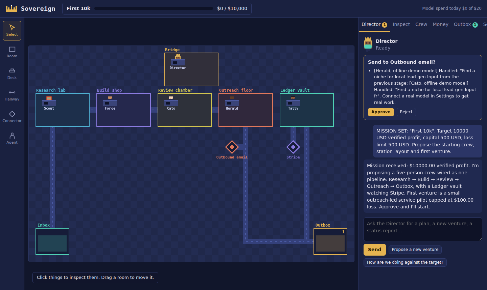

# Sovereign

**A neon command station where a Director agent and its team of agents build and run businesses toward a profit target you set.**



You set a mission: a verified-profit target, starting capital, and the most you will lose. The **Director**, the first agent on the station, designs the agents, rooms and hallways and proposes a first venture, then asks you to approve. Agents work concurrently from their own desks, hand work down hallways, and deliver to the Outbox. Connectors pull real numbers from Stripe, Shopify, Etsy and Facebook Ads into a ledger that only believes money a platform has confirmed.

Autonomous does not mean unsupervised. Sovereign is built around **human-gated autonomy**: agents grind between checkpoints, and you approve the few decisions that are structural, expensive or irreversible. It does not guarantee profit, and most early ventures will lose small amounts. That is what loss limits are for.

## The station

| Piece | What it is |
|---|---|
| **Room** | A team. Its capabilities are the *ceiling* for everyone inside. Draw, rename, resize and retype rooms. |
| **Desk** | Every agent has their own. What an agent can do = desk grants ∩ room ceiling ∩ role ceiling. |
| **Hallway** | An authorized handoff lane between rooms, connectors, the Inbox and the Outbox. Chevrons show direction. |
| **Connector** | A port to the outside world. A hallway can only reach it from a room with the matching capability. |
| **Inbox / Outbox** | Where work enters and where finished results land as real items, not chat scrollback. |
| **Director** | The first agent, crowned and locked in. Only the Director holds `station.edit` and `venture.create`. It proposes plans; you approve. |

**Agents** come in 19 roles (Lead Generator, Copywriter, Content Manager, Ad Manager, Store Manager, Email Outreach, Sales Closer, Market Researcher, Data Analyst, Designer, Builder, Developer, Customer Support, Operations, Finance, Critic and Compliance, Social Media Manager, Custom) and 17 character presets (Astronaut, The Chemist, The Guide, Suit, Hacker, Cyborg, Scientist, Captain, Noir, Trader, Operator, Robot, Engineer, Lab Cook, Founder, Diplomat, Commander) that you can fine-tune head to toe. Add an agent and they get their own desk automatically, in a room that fits the role, growing the room or opening a new one if needed.

**Layout:** tool rail and panels on the left (Inspect, Agents, Money, Outbox, Settings), the station in the middle (scroll to zoom, drag the floor to pan), and a chat on the right where you talk to whichever agent you select. Approvals appear at the top of the chat.

## Run it

```
git clone <your repo>
cd sovereign
npm start          # Node 18+, no install step, zero dependencies
```

Open http://localhost:8787, click **Set a mission**, and approve the Director's plan. It works out of the box on an offline demo model. In **Settings** choose a real provider: OpenRouter, Ollama (set the address, click Detect models), or any OpenAI-compatible endpoint. `npm test` runs the suite.

## Integrations

Stripe, Shopify, Etsy and Facebook Ads feed the verified ledger (read-only). Email (Resend), Notion, Google Drive and Google Calendar take actions that wait for your approval. See [docs/INTEGRATIONS.md](docs/INTEGRATIONS.md) for setup and an honest status of what is and is not proven.

## The laws (enforced in code, tested)

1. **The interface never asserts money the harness cannot prove.** Only platform data the harness fetched itself, signed webhooks, and measured model spend are *verified*. Agent claims are stored but never counted.
2. **Budgets and approvals live in code, not prompts.** Daily station and per-agent caps. Director plans and every outbound email, Notion page, Drive file and calendar event need your approval by default. Email has a hard daily send limit.
3. **Kill rules have no vote.** A venture that reaches its verified loss limit is stopped automatically.
4. **Only the Director edits the station.** Director-only capabilities are stripped from everyone else.
5. **Plans are atomic.** A Director plan is dry-run before you see it and rolls back completely if any step fails.
6. **Secrets are write-only.** Keys and tokens never leave the sidecar and never appear in an API response or error message.
7. **Local first.** Binds to 127.0.0.1 and rejects foreign origins.

## Repo map

```
sidecar/            Local Node runtime: API, station model, agents, roles, avatars, Director, runner, ledger, guardrails
  lib/integrations/   Adapters: stripe, shopify, etsy, meta_ads, notion, email, google (calendar, drive) + oauth
  lib/providers/      mock, openrouter, ollama, openai-compatible
frontend/           Vanilla JS station: scene.js (renderer), avatar.js (sprites), app.js (core + chat), panels.js, editor.js
docs/               ARCHITECTURE, DIRECTOR, GUARDRAILS, LEDGER, INTEGRATIONS, VENTURES, API, ROADMAP
recipes/            Draft format for reusable ventures (engine lands later)
test/               Node test runner suite (unit, integration with stubbed APIs, server)
```

## Status (v0.2)

Real and tested: station editor with zoom and pan, 19 roles, 17 character presets, own-desk placement, Director plans with approvals, pipeline dispatch, chat with any agent, budgets, signed ledger ingestion, kill rules, Ollama / OpenRouter / OpenAI-compatible providers, and all eight integration adapters against stubbed HTTP.
Not yet proven: the adapters have not been run against live Stripe, Shopify, Etsy, Meta, Notion, Resend or Google accounts. Test each with your own credentials before trusting it. No scheduler or recipes engine yet. See [docs/ROADMAP.md](docs/ROADMAP.md).
